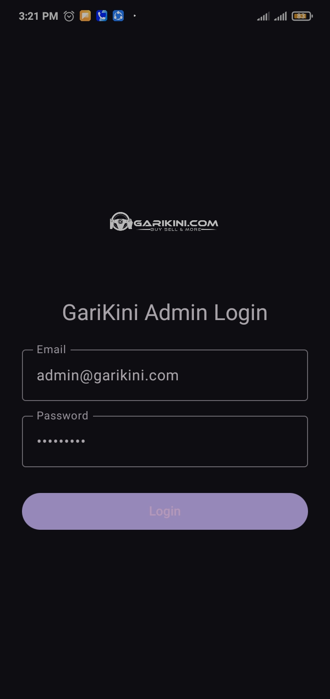
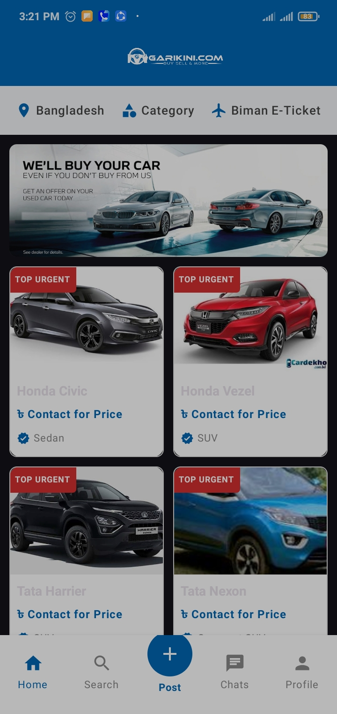
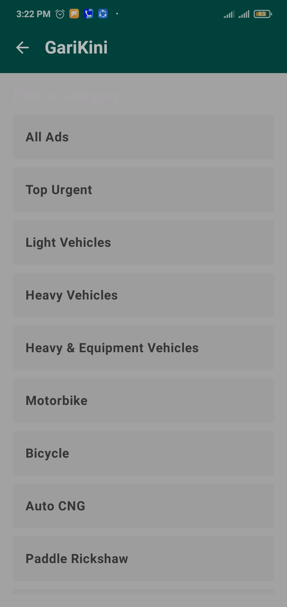
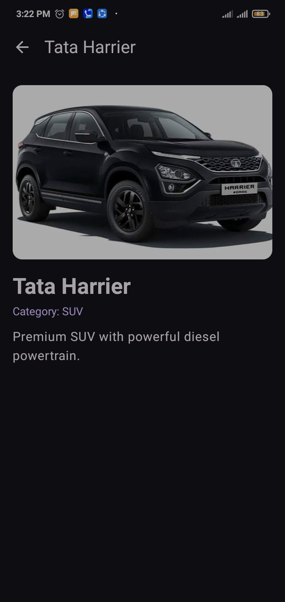

# GariKini

GariKini is an Android vehicle marketplace app (inspired by "buy, sell & more" classifieds) built with **Kotlin** and **Jetpack Compose**. Users can browse vehicle ads on a home feed, pick a category, and open a detail page for each vehicle. An admin login screen is included.

## Screenshots

| Admin Login | Home | Category | Detail |
|---|---|---|---|
|  |  |  |  |

## Features

- Admin login screen (email and password)
- Home feed with a promotional banner and "TOP URGENT" vehicle cards
- Top bar shortcuts: location, Category, Biman E-Ticket
- Bottom navigation: Home, Search, Post, Chats, Profile
- Category list: All Ads, Top Urgent, Light Vehicles, Heavy Vehicles, Heavy & Equipment Vehicles, Motorbike, Bicycle, Auto CNG, Paddle Rickshaw and more
- Vehicle detail screen with image, name, category and description
- Screen-to-screen movement using Jetpack Compose Navigation

## Tech Stack

| Item | Details |
|---|---|
| Language | Kotlin |
| UI | Jetpack Compose (Material 3) |
| Navigation | Navigation Compose |
| Build system | Gradle (Kotlin DSL) |
| IDE | Android Studio |
| Package | `com.example.garikini` |

## Project Structure

```
GariKini/
├── app/src/main/java/com/example/garikini/
│   ├── MainActivity.kt          # Entry point and navigation setup
│   ├── model/
│   │   ├── VehicleModel.kt      # Vehicle data class and sample data
│   │   └── AdminData.kt         # Admin login data
│   └── ui/
│       ├── LoginScreen.kt
│       ├── HomeScreen.kt
│       ├── DetailScreen.kt
│       ├── GenericScreens.kt
│       └── theme/
│           ├── CategoryScreen.kt
│           ├── Color.kt
│           ├── Theme.kt
│           └── Type.kt
├── app/src/main/res/drawable/   # Vehicle images and logo
├── screenshots/                 # README screenshots
├── build.gradle.kts
├── settings.gradle.kts
└── gradle/
```

## How to Run

### Requirements

- Android Studio (latest stable version recommended)
- JDK 17 or newer (the one bundled with Android Studio works)
- Android SDK installed through Android Studio
- An Android emulator or a physical device (Android 8.0+ recommended)

### Steps

1. **Clone the repository**

   ```bash
   git clone https://github.com/Ifteker1144/GariKini.git
   ```

2. **Open in Android Studio**

   `File > Open`, then select the cloned `GariKini` folder.

3. **Wait for Gradle sync**

   The first sync downloads dependencies and can take a few minutes.

4. **Select a device**

   Create an emulator from `Tools > Device Manager`, or connect a phone with USB debugging enabled.

5. **Run the app**

   Click the green **Run** button (or press `Shift + F10`). The app opens on the admin login screen; the demo admin account is defined in `model/AdminData.kt`.

### Build from the command line (optional)

```bash
./gradlew assembleDebug
```

On Windows:

```bash
gradlew.bat assembleDebug
```

The APK is generated at `app/build/outputs/apk/debug/`.

## Troubleshooting

| Problem | Fix |
|---|---|
| `SDK location not found` | Open the project in Android Studio; it creates `local.properties` automatically. |
| Gradle sync fails | Check your internet connection, then `File > Sync Project with Gradle Files`. |
| Emulator is slow | Enable hardware acceleration (HAXM / Hyper-V) in your BIOS and SDK Manager. |

## Author

**Md Ifteker Uddin Chowdhury**
GitHub: [@Ifteker1144](https://github.com/Ifteker1144)

## License

This project is for educational purposes.
